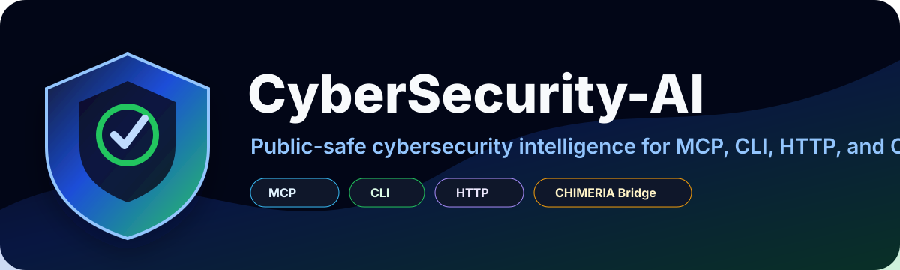
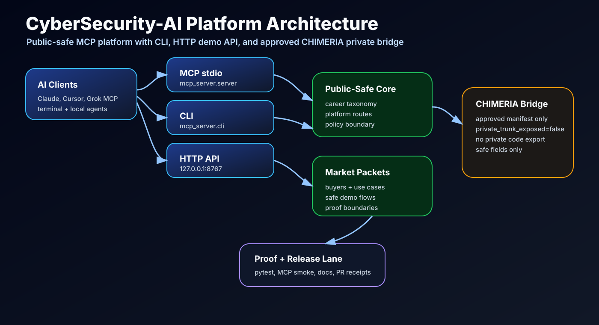
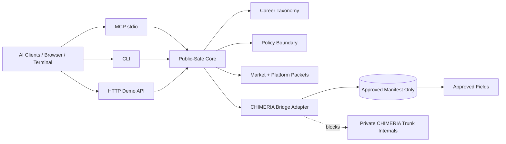

<p align="center">
  
</p>

# CyberSecurity-AI

[](LICENSE)
[](https://modelcontextprotocol.io)
[](#cli)
[](docs/API.md)
[](docs/PRODUCTION_BOUNDARY.md)

**CyberSecurity-AI** is a public-safe cybersecurity intelligence platform for MCP clients, command-line workflows, local HTTP demos, security-role mapping, and approved private CHIMERIA bridge packets.

It is the market-facing cybersecurity lane for the Medina / MESIE ecosystem. **CHIMERIA remains the private trunk**. CyberSecurity-AI can use CHIMERIA only through approved public-safe manifests; it does not expose private CHIMERIA implementation details.



## Platform Surfaces

| Surface | Command | Purpose |
|---|---|---|
| MCP stdio | `python -m mcp_server.server` | Connect Claude Desktop, Cursor, Grok-compatible MCP hosts, and local agents |
| CLI | `cybersecurity-ai platform` | Local operator packets, demos, search, market packets, bridge checks |
| HTTP demo API | `cybersecurity-ai-http --port 8767` | Browser/local dashboard-ready JSON endpoints |
| CHIMERIA bridge | `CHIMERIA_BRIDGE_MANIFEST=/secure/path/public_bridge_manifest.json` | Approved private manifest consumption without exposing the trunk |

## What It Does

- Turns cybersecurity roles, teams, skills, and defensive workflows into live AI tools.
- Supports SOC, incident response, GRC, IAM, cloud security, zero-trust, and threat-intelligence use cases.
- Runs across MCP clients, terminal workflows, local demos, and platform pilots.
- Provides a protected `chimeria_bridge_status` and `chimeria_route` path for approved private manifests.
- Keeps the public repo defensive, educational, marketable, and safe.

## MCP Tools

| Tool | Description |
|------|-------------|
| `career_list` | List careers by team/stage |
| `career_get` | Full compressed public-safe career profile |
| `career_search` | Keyword search across roles and capabilities |
| `career_invoke` | Create a safe career intelligence packet for platform use |
| `career_triple_route` | MESIE P1/P2/P3 routing map plus CHIMERIA bridge status |
| `chimeria_bridge_status` | Check approved private CHIMERIA manifest connection |
| `chimeria_route` | Route a public-safe packet toward the private CHIMERIA bridge boundary |
| `platform_summary` | Full platform packet for demos and pilots |
| `platform_routes` | MCP, CLI, HTTP, and bridge route inventory |
| `architecture_map` | Architecture planes and data flows |
| `market_packet` | Market-safe positioning packet for an audience |
| `policy_check` | Check text against the public CyberSecurity-AI boundary |

## Quick Start

```bash
git clone https://github.com/ItsNotAILABS/CyberSecurity-AI.git
cd CyberSecurity-AI
python -m pip install -e .
```

Run MCP:

```bash
python -m mcp_server.server
```

Run CLI:

```bash
cybersecurity-ai platform
cybersecurity-ai search iam
cybersecurity-ai architecture
cybersecurity-ai bridge
```

Run local HTTP demo API:

```bash
cybersecurity-ai-http --host 127.0.0.1 --port 8767
```

Open:

```text
http://127.0.0.1:8767/platform
http://127.0.0.1:8767/careers
http://127.0.0.1:8767/search?q=iam
http://127.0.0.1:8767/architecture
http://127.0.0.1:8767/bridge
```

## MCP Configuration

```json
{
  "mcpServers": {
    "cybersecurity-ai": {
      "command": "python",
      "args": ["-m", "mcp_server.server"],
      "cwd": "/absolute/path/to/CyberSecurity-AI",
      "env": {
        "MESIE_CAREER_PILLAR": "cybersecurity"
      }
    }
  }
}
```

## Optional CHIMERIA Bridge

CHIMERIA is the private trunk. CyberSecurity-AI can use CHIMERIA only through an approved bridge manifest.

```bash
export CHIMERIA_BRIDGE_MANIFEST=/secure/path/public_bridge_manifest.json
```

or:

```bash
export CHIMERIA_BRIDGE_DIR=/secure/path/chimeria-bridge
```

The public adapter only reads approved fields and always reports:

```json
{
  "private_trunk_exposed": false
}
```

## Architecture Flow



## Smoke Test

```bash
printf '{"jsonrpc":"2.0","id":1,"method":"tools/list","params":{}}\n' | python -m mcp_server.server
```

## Test

```bash
python -m pip install -e .
python -m pytest -q
```

## Market Position

CyberSecurity-AI is designed for:

- AI builders who need a cybersecurity MCP.
- Cybersecurity teams mapping roles, skills, and workflows.
- Training providers building SOC, IR, GRC, IAM, cloud-security, and threat-intelligence curricula.
- Enterprise pilots that need a safe public intelligence layer with a private defense trunk behind it.

## Documentation

- [Architecture](docs/ARCHITECTURE.md)
- [Flows](docs/FLOWS.md)
- [Local API](docs/API.md)
- [Platform Marketing Pack](docs/PLATFORM_MARKETING.md)
- [MCP Client Setup](docs/MCP_CLIENTS.md)
- [Platform Roadmap](docs/PLATFORM_ROADMAP.md)
- [Production Boundary](docs/PRODUCTION_BOUNDARY.md)
- [CHIMERIA Bridge](docs/CHIMERIA_BRIDGE.md)

## Boundary

CyberSecurity-AI is defensive and educational. It does not provide exploit instructions, malware workflows, unauthorized-access guidance, or private CHIMERIA trunk implementation details.

## License

MIT — see [LICENSE](LICENSE).
