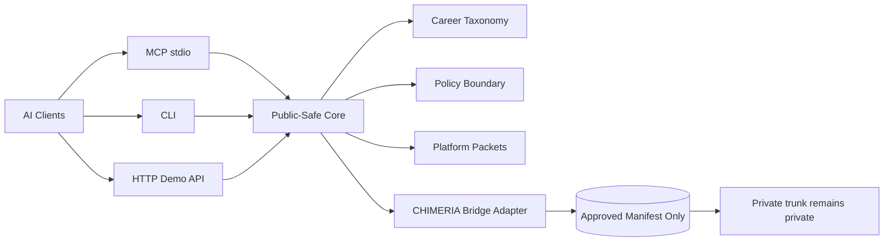

# CyberSecurity-AI Architecture

CyberSecurity-AI is now structured as a public-safe cybersecurity intelligence platform, not only a README or single MCP script.


## System Planes

| Plane | Components | Purpose |
|---|---|---|
| Client plane | Claude Desktop, Cursor, Grok-compatible MCP hosts, terminal, browser | Entry points for users and agents |
| Interface plane | MCP stdio, CLI, local HTTP demo API | Multi-platform access |
| Intelligence plane | Career taxonomy, platform routes, policy boundary, market packets | Public-safe cyber intelligence |
| Bridge plane | CHIMERIA approved manifest adapter | Private trunk consumption without disclosure |
| Proof plane | Tests, smoke commands, docs, PR receipts | Release confidence and audit trail |

## Runtime Surfaces



## Public-Safe Core

The core is intentionally defensive and market-safe. It supports career intelligence, onboarding, SOC/IR/GRC/IAM mapping, cloud-security readiness, and platform demos.

It does not expose exploit workflows, malware guidance, unauthorized-access guidance, or private CHIMERIA internals.

## CHIMERIA Bridge

CyberSecurity-AI does not import private CHIMERIA code. It reads an approved manifest through either:

```bash
CHIMERIA_BRIDGE_MANIFEST=/secure/path/public_bridge_manifest.json
```

or:

```bash
CHIMERIA_BRIDGE_DIR=/secure/path/chimeria-bridge
```

Only approved fields are emitted. The adapter always reports:

```json
{
  "private_trunk_exposed": false
}
```

## Deployment Boundary

Current service status is **local-first alpha platform**:

- MCP server: local stdio
- CLI: local terminal
- HTTP API: local demo server
- CHIMERIA bridge: local approved-manifest adapter
- External SaaS deployment: not claimed
- Compliance/certification: not claimed
