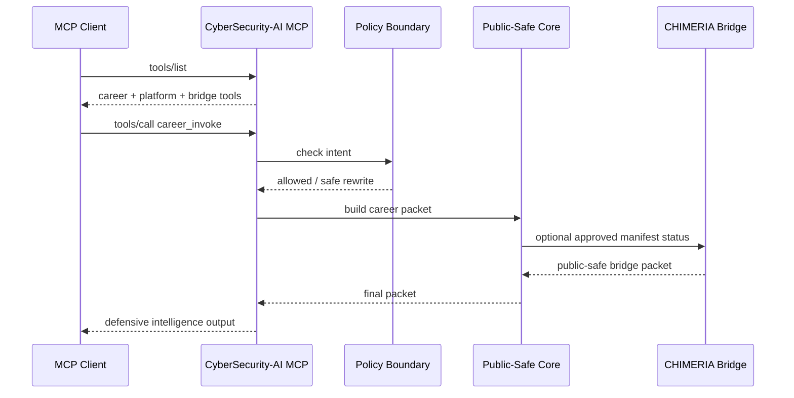
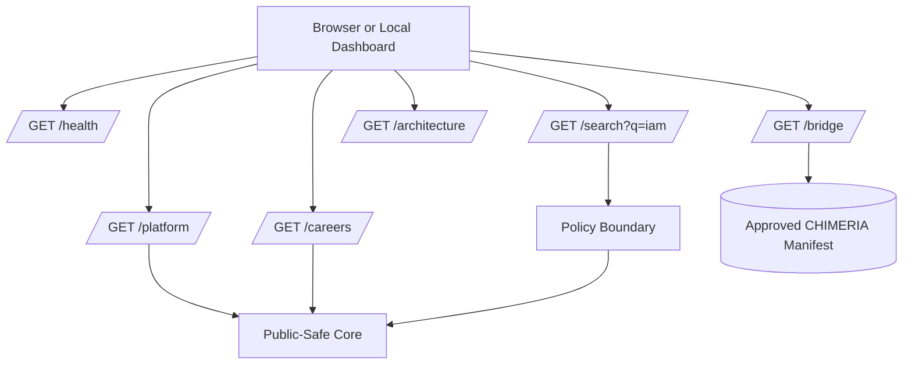
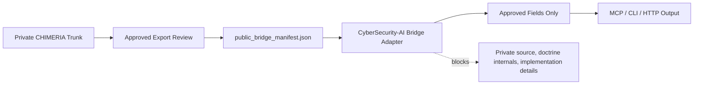
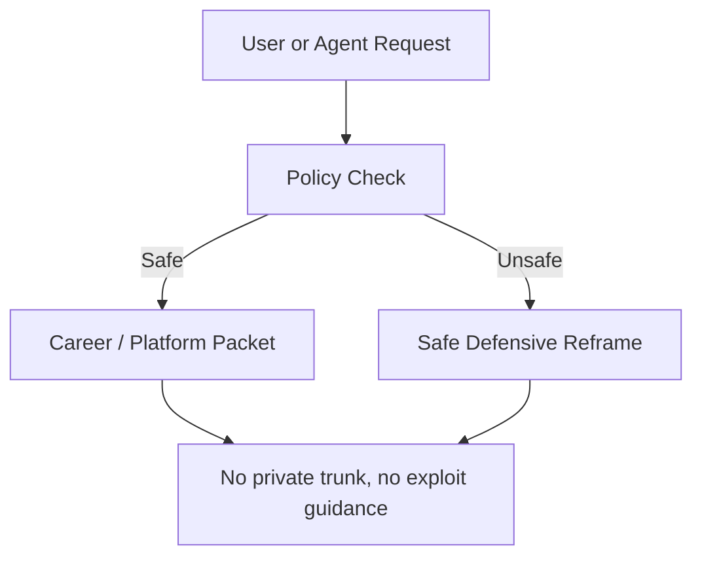

# CyberSecurity-AI Flows

## 1. MCP Client Flow

## 2. Local HTTP Demo Flow

## 3. Private CHIMERIA Bridge Flow

## 4. Marketing Demo Flow

1. Show the README architecture image.
2. Run MCP smoke test.
3. Run CLI platform packet.
4. Run local HTTP demo API.
5. Search a safe career term.
6. Show CHIMERIA bridge status closed by default.
7. Optional private demo: set approved manifest and show safe bridge status.

## 5. Safety Flow

