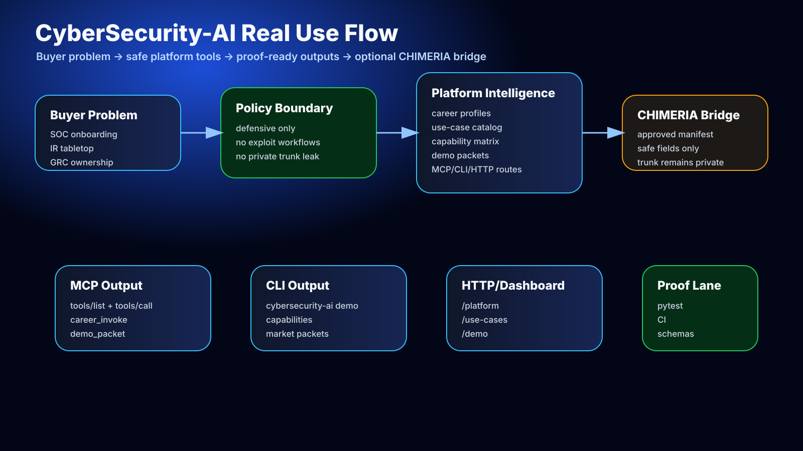

# Real Use Cases

CyberSecurity-AI is built to become a usable security platform surface, not a vague AI/cyber repo. The current platform supports defensive workflows that can be demonstrated through MCP, CLI, HTTP, and dashboard surfaces.



## Use-Case Catalog

| ID | Buyer | Real Output |
|---|---|---|
| `soc-onboarding-copilot` | MSSPs, enterprise SOC teams, bootcamps | Analyst role packet, first-week plan, escalation checklist, skill gap map |
| `incident-tabletop-builder` | Security leaders, IR consultants, compliance teams | Tabletop agenda, RACI map, evidence checklist, recovery brief |
| `grc-control-owner-map` | GRC teams, audit-prep startups, platform vendors | Control owner matrix, evidence plan, risk summary |
| `iam-zero-trust-maturity` | IT leaders, IAM teams, security architects | IAM maturity map, access review plan, zero-trust roadmap |
| `ai-security-product-enablement` | AI app teams, developer tooling teams | Safe MCP security vocabulary, prompt boundary, product integration packet |
| `chimeria-approved-private-demo` | Private pilots, MedinaSITech internal team, trusted partners | Approved manifest status, release boundary proof, private_trunk_exposed=false receipt |

## Demo Commands

```bash
cybersecurity-ai use-cases
cybersecurity-ai use-case soc-onboarding-copilot
cybersecurity-ai capabilities
cybersecurity-ai demo --use-case incident-tabletop-builder
```

## HTTP Demo

```bash
cybersecurity-ai-http --host 127.0.0.1 --port 8767
```

Then open:

```text
http://127.0.0.1:8767/use-cases
http://127.0.0.1:8767/capabilities
http://127.0.0.1:8767/demo?use_case=soc-onboarding-copilot
```

## MCP Demo

Ask an MCP client to call:

- `use_case_list`
- `use_case_get`
- `capability_matrix`
- `demo_packet`
- `policy_check`
- `chimeria_bridge_status`

## Boundary

All use cases are public-safe and defensive. They support planning, onboarding, training, governance, and maturity mapping. They do not provide exploit reproduction, malware guidance, credential theft, evasion, or private CHIMERIA trunk implementation details.
